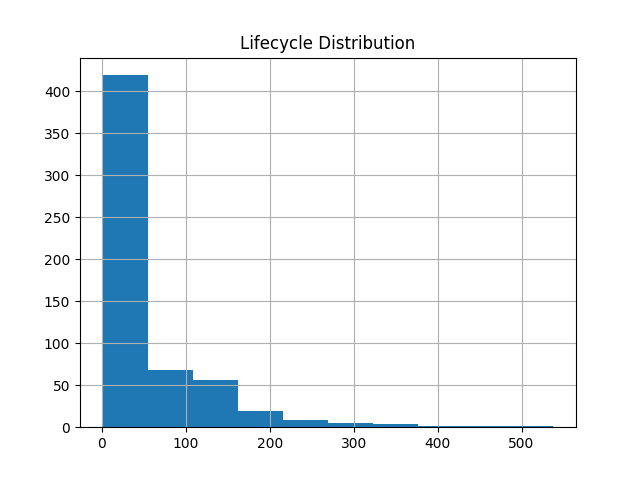
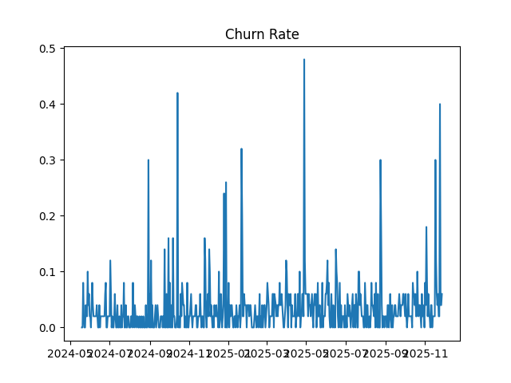
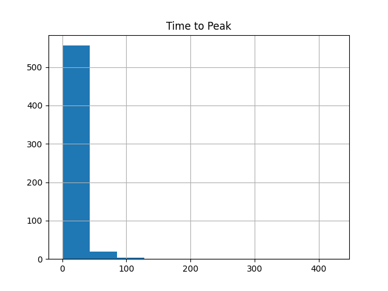

# 🎧 Spain Top 50 Music Lifecycle Intelligence Analysis


---

# 📌 Overview

This project analyzes the lifecycle dynamics, playlist churn, and content maturity of songs in Spain’s Top 50 playlist using streaming data analytics.

The project explores:
- ⏳ Song lifecycle analysis
- 🔄 Playlist churn & retention
- 🎼 Content maturity insights
- 📈 Streaming behavior trends
- 📊 Interactive dashboard analytics

---

# 🎯 Objectives

- Build lifecycle models for songs
- Analyze playlist entry and exit behavior
- Measure churn rates
- Compare explicit vs non-explicit content
- Compare album tracks vs singles
- Generate strategic business recommendations

---

# 📁 Project Structure

```bash
Spain-Top-50-Music-Lifecycle-Intelligence-Analysis/
│
├── data/
│   └── Atlantic_Spain.csv
│
├── dashboard/
│   └── app.py
│
├── outputs/
│   ├── charts/
│   ├── lifecycle_summary.csv
│   └── churn_analysis.csv
│
├── notebooks/
│   └── eda.ipynb
│
├── research_paper/
│   └── paper.pdf
│
└── README.md
```

---

# ⚙️ Tech Stack

| Technology | Usage |
|---|---|
| Python | Data Analysis |
| Pandas | Data Processing |
| NumPy | Numerical Computing |
| Matplotlib | Visualization |
| Streamlit | Dashboard |

---

# 🚀 Run Locally

## 1️⃣ Clone Repository

```bash
git clone https://github.com/your-username/Spain-Top-50-Music-Lifecycle-Intelligence-Analysis.git
```

---

## 2️⃣ Move Into Folder

```bash
cd Spain-Top-50-Music-Lifecycle-Intelligence-Analysis
```

---

## 3️⃣ Install Dependencies

```bash
pip install -r requirements.txt
```

---

## 4️⃣ Run Streamlit App

```bash
streamlit run dashboard/app.py
```

---

# 🌐 Live Demo

👉 Streamlit Cloud link here

https://spain-top-50-playlist-lifecycle-analysis-ctifb5njvdoswnj6ng3wy.streamlit.app/
```

---

# 📊 Sample Visualizations

## 🎼 Lifecycle Distribution



---

## 🔄 Playlist Churn



---

## ⏱ Time to Peak



---

# 📈 Key Insights

- High playlist churn indicates rapid turnover
- Songs peak early after release
- New content dominates playlist entries
- Singles outperform album tracks
- Non-explicit songs retain audiences longer

---

# 📄 Research Paper

This project includes:
- Exploratory Data Analysis (EDA)
- Lifecycle modeling
- Churn analysis
- Strategic recommendations
- IEEE-style formatted research paper

---

# 💼 Business Impact

This analysis helps:
- Optimize release strategies
- Improve playlist visibility
- Understand audience engagement
- Build data-driven music marketing strategies

---

# 👨‍💻 Author

## Kaushik Prasad

Data Analyst
📧 Email: kaushikprashad1234@gmail.com

🔗 LinkedIn

https://www.linkedin.com/in/kaushik-prashad-01416a235?utm_source=share&utm_campaign=share_via&utm_content=profile&utm_medium=android_app

🔗 Portfolio

---

# ⭐ Future Improvements

- Plotly interactive visualizations
- Machine learning hit prediction
- Retention curve modeling
- Cross-country playlist comparison
- Recommendation engine integration

---

# 📜 License

This project is intended for educational and analytical purposes.
